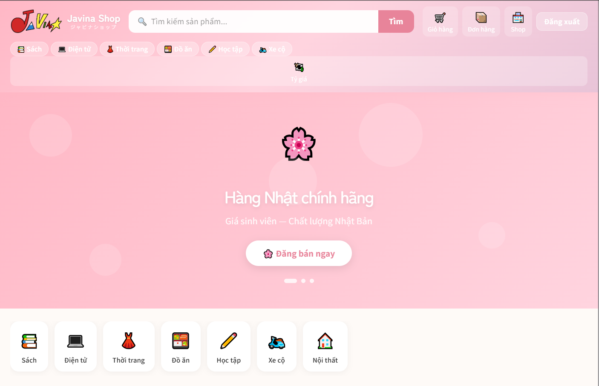
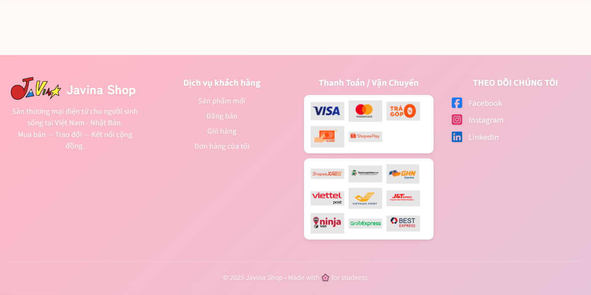

# 🌸 Javina Shop
### ジャビナショップ — Sàn thương mại điện tử dành cho sinh viên

<div align="center">


[](https://nodejs.org)
[](https://react.dev)
[](https://mysql.com)
[](https://vitejs.dev)
[](LICENSE)

**Mua bán • Trao đổi • Kết nối cộng đồng sinh viên**

[🚀 Demo](#) • [📖 Tài liệu](#hướng-dẫn-cài-đặt) • [🐛 Báo lỗi](issues)

</div>

---

## 📋 Mục lục

- [Giới thiệu](#-giới-thiệu)
- [Tính năng chính](#-tính-năng-chính)
- [Công nghệ sử dụng](#-công-nghệ-sử-dụng)
- [Cấu trúc dự án](#-cấu-trúc-dự-án)
- [Yêu cầu hệ thống](#-yêu-cầu-hệ-thống)
- [Hướng dẫn cài đặt](#-hướng-dẫn-cài-đặt)
- [Cấu hình môi trường](#-cấu-hình-môi-trường)
- [Chạy dự án](#-chạy-dự-án)
- [API Documentation](#-api-documentation)
- [Giao diện](#-giao-diện)
- [Đóng góp](#-đóng-góp)
- [Liên hệ](#-liên-hệ)

---

## 🌸 Giới thiệu

**Javina Shop** là nền tảng thương mại điện tử được thiết kế riêng cho cộng đồng sinh viên Việt Nam, lấy cảm hứng từ phong cách Nhật Bản (pastel, dễ thương, tinh tế).

Khác với các sàn TMĐT thông thường như Shopee hay Lazada, Javina Shop tập trung vào:

- 🎓 **Cộng đồng sinh viên** — Mua bán trong nội bộ trường, tăng độ tin cậy
- 💰 **Giá sinh viên** — Hàng cũ, sách giáo trình, đồ dùng học tập giá rẻ
- 🇯🇵 **Hàng Việt - Nhật** — Hỗ trợ xem giá theo VNĐ và JPY với biểu đồ tỷ giá thời gian thực
- 📊 **Dự đoán tỷ giá** — Thuật toán Linear Regression dự đoán xu hướng 1-2 ngày tới

---

## ✨ Tính năng chính

### 👤 Người dùng
- Đăng ký / Đăng nhập với JWT Authentication
- Hồ sơ sinh viên (tên trường, mã sinh viên)
- Quản lý địa chỉ giao hàng (nhà, ký túc xá, trường...)

### 🛍️ Mua sắm
- Tìm kiếm và lọc sản phẩm theo danh mục
- Xem chi tiết sản phẩm với gallery ảnh
- **Đổi giá VNĐ ⇄ JPY** ngay trên trang sản phẩm
- Thêm vào giỏ hàng, điều chỉnh số lượng
- Đặt hàng COD (thanh toán khi nhận hàng)
- Theo dõi trạng thái đơn hàng

### 🏪 Người bán
- Tạo gian hàng tự động khi đăng sản phẩm
- Đăng bán sản phẩm với nhiều danh mục
- Dashboard thống kê doanh thu, đơn hàng
- Quản lý đơn hàng và cập nhật trạng thái
- Top sản phẩm bán chạy

### 💱 Tỷ giá VNĐ / JPY
- Biểu đồ tỷ giá lịch sử **7 ngày**
- Lọc theo: **3 tiếng / 12 tiếng / 1 ngày / 3 ngày / 7 ngày**
- Cập nhật tự động mỗi **30 phút** (1,500 req/tháng)
- **Dự đoán 1-2 ngày tới** bằng thuật toán Linear Regression
- Nút đổi tiền tệ trên trang chủ và giỏ hàng

---

## 🛠️ Công nghệ sử dụng

### Backend
| Công nghệ | Phiên bản | Mục đích |
|---|---|---|
| Node.js | v20+ | Runtime environment |
| Express.js | v4+ | Web framework |
| MySQL2 | v3+ | Database driver |
| JWT | - | Authentication |
| bcryptjs | - | Password hashing |
| node-cron | - | Scheduled jobs |
| axios | - | HTTP client |

### Frontend
| Công nghệ | Phiên bản | Mục đích |
|---|---|---|
| React | v18+ | UI framework |
| Vite | v5+ | Build tool |
| React Router DOM | v6+ | Client-side routing |
| Axios | - | API calls |
| Recharts | - | Biểu đồ tỷ giá |

### Database & Tools
| Công nghệ | Mục đích |
|---|---|
| MySQL 8.0+ | Cơ sở dữ liệu chính |
| MySQL Workbench | Quản lý database |
| Thunder Client | Test API |
| ExchangeRate-API | Dữ liệu tỷ giá JPY/VND |

---

## 📁 Cấu trúc dự án

```
javina-shop/
│
├── 📂 backend/                  # Node.js + Express API
│   ├── 📂 config/
│   │   └── db.js                # Kết nối MySQL
│   ├── 📂 src/
│   │   ├── 📂 controllers/      # Xử lý logic
│   │   │   ├── auth.controller.js
│   │   │   ├── product.controller.js
│   │   │   ├── cart.controller.js
│   │   │   ├── order.controller.js
│   │   │   ├── shop.controller.js
│   │   │   └── currency.controller.js
│   │   ├── 📂 routes/           # Định nghĩa API routes
│   │   │   ├── auth.route.js
│   │   │   ├── product.route.js
│   │   │   ├── cart.route.js
│   │   │   ├── order.route.js
│   │   │   ├── shop.route.js
│   │   │   ├── category.route.js
│   │   │   ├── address.route.js
│   │   │   └── currency.route.js
│   │   ├── 📂 middlewares/
│   │   │   └── auth.middleware.js  # JWT verification
│   │   └── 📂 jobs/
│   │       └── currency.job.js     # Cron job tỷ giá
│   ├── .env                     # Biến môi trường (không commit)
│   ├── .env.example             # Mẫu biến môi trường
│   └── server.js                # Entry point
│
├── 📂 frontend/                 # React + Vite
│   ├── 📂 src/
│   │   ├── 📂 api/
│   │   │   └── axios.js         # Axios instance + interceptors
│   │   ├── 📂 components/
│   │   │   ├── Navbar.jsx
│   │   │   ├── Footer.jsx
│   │   │   ├── CurrencyChart.jsx
│   │   │   └── CurrencyToggle.jsx
│   │   ├── 📂 context/
│   │   │   └── AuthContext.jsx  # Global auth state
│   │   ├── 📂 pages/
│   │   │   ├── Home.jsx
│   │   │   ├── Login.jsx
│   │   │   ├── Register.jsx
│   │   │   ├── ProductDetail.jsx
│   │   │   ├── CreateProduct.jsx
│   │   │   ├── Cart.jsx
│   │   │   ├── Checkout.jsx
│   │   │   ├── OrderSuccess.jsx
│   │   │   ├── MyOrders.jsx
│   │   │   ├── Dashboard.jsx
│   │   │   ├── ManageOrders.jsx
│   │   │   ├── ManageProducts.jsx
│   │   │   └── Currency.jsx
│   │   ├── 📂 styles/
│   │   │   ├── global.css       # Variables + reset
│   │   │   ├── components.css   # Navbar, Footer, Card...
│   │   │   └── pages.css        # Page-specific styles
│   │   ├── App.jsx
│   │   └── main.jsx
│   └── vite.config.js
│
├── 📄 minishopee_schema.sql     # Database schema đầy đủ
└── 📄 README.md
```

---

## 💻 Yêu cầu hệ thống

Trước khi cài đặt, đảm bảo máy tính đã có:

| Phần mềm | Phiên bản tối thiểu | Kiểm tra |
|---|---|---|
| Node.js | v18.0+ | `node -v` |
| npm | v9.0+ | `npm -v` |
| MySQL | v8.0+ | MySQL Workbench |
| Git | Bất kỳ | `git -v` |

---

## 🚀 Hướng dẫn cài đặt

### Bước 1 — Clone dự án

```bash
git clone https://github.com/your-username/javina-shop.git
cd javina-shop
```

### Bước 2 — Tạo Database MySQL

Mở **MySQL Workbench**, kết nối vào local instance, rồi chạy:

```sql
-- Chạy toàn bộ file schema
SOURCE /đường/dẫn/tới/javina-shop/minishopee_schema.sql;
```

Hoặc vào **File → Open SQL Script** → chọn file `minishopee_schema.sql` → bấm ⚡ Execute

Sau đó thêm bảng tỷ giá:

```sql
USE `javina-shop`;

CREATE TABLE IF NOT EXISTS currency_rates (
    id          BIGINT UNSIGNED AUTO_INCREMENT PRIMARY KEY,
    vnd_to_jpy  DECIMAL(10,6)   NOT NULL,
    jpy_to_vnd  DECIMAL(10,4)   NOT NULL,
    source      VARCHAR(50)     DEFAULT 'exchangerate-api',
    recorded_at DATETIME        NOT NULL DEFAULT CURRENT_TIMESTAMP,
    INDEX idx_recorded (recorded_at)
) ENGINE=InnoDB;
```

### Bước 3 — Cài đặt Backend

```bash
cd backend
npm install
```

### Bước 4 — Cài đặt Frontend

```bash
cd ../frontend
npm install
```

### Bước 5 — Đăng ký API tỷ giá (miễn phí)

1. Truy cập [https://app.exchangerate-api.com/sign-in](https://app.exchangerate-api.com/sign-in)
2. Đăng ký tài khoản miễn phí
3. Copy **API Key** từ Dashboard

---

## ⚙️ Cấu hình môi trường

### Backend — Tạo file `backend/.env`

```bash
# Copy từ file mẫu
cp backend/.env.example backend/.env
```

Mở file `backend/.env` và điền thông tin:

```env
# ── Database ──────────────────────────────
DB_HOST=127.0.0.1
DB_PORT=3306
DB_USER=root
DB_PASSWORD=mật_khẩu_mysql_của_bạn
DB_NAME=javina-shop

# ── Authentication ─────────────────────────
JWT_SECRET=javina_secret_key_2024_change_this

# ── Server ────────────────────────────────
PORT=5000

# ── Currency API ──────────────────────────
# Lấy tại: https://app.exchangerate-api.com
EXCHANGE_RATE_API_KEY=your_api_key_here
```

> ⚠️ **Lưu ý bảo mật:** Không bao giờ commit file `.env` lên GitHub! File này đã được thêm vào `.gitignore`

### Frontend — Tạo file `frontend/.env`

```env
VITE_API_URL=http://localhost:5000/api
```

---

## ▶️ Chạy dự án

Mở **2 terminal riêng biệt** trong VSCode (`Ctrl + `` ` ```)

### Terminal 1 — Chạy Backend

```bash
cd backend
npm run dev
```

Kết quả mong đợi:
```
🚀 Server: http://localhost:5000
✅ MySQL connected!
💱 Currency job started
✅ [08:30:00] 1 JPY = 168.45 VND
```

### Terminal 2 — Chạy Frontend

```bash
cd frontend
npm run dev
```

Kết quả mong đợi:
```
  VITE v5.x.x  ready in 300 ms
  ➜  Local:   http://localhost:5173/
```

### Truy cập ứng dụng

| Địa chỉ | Mô tả |
|---|---|
| http://localhost:5173 | Trang chủ website |
| http://localhost:5173/login | Đăng nhập |
| http://localhost:5173/register | Đăng ký |
| http://localhost:5173/currency | Biểu đồ tỷ giá |
| http://localhost:5000 | Backend API |

---

## 📡 API Documentation

### Authentication
| Method | Endpoint | Mô tả | Auth |
|---|---|---|---|
| POST | `/api/auth/register` | Đăng ký tài khoản | ❌ |
| POST | `/api/auth/login` | Đăng nhập | ❌ |
| GET | `/api/auth/me` | Thông tin bản thân | ✅ |

### Sản phẩm
| Method | Endpoint | Mô tả | Auth |
|---|---|---|---|
| GET | `/api/products` | Danh sách sản phẩm | ❌ |
| GET | `/api/products/:id` | Chi tiết sản phẩm | ❌ |
| POST | `/api/products` | Tạo sản phẩm mới | ✅ |
| PUT | `/api/products/:id` | Cập nhật sản phẩm | ✅ |
| DELETE | `/api/products/:id` | Xoá sản phẩm | ✅ |

### Giỏ hàng
| Method | Endpoint | Mô tả | Auth |
|---|---|---|---|
| GET | `/api/cart` | Xem giỏ hàng | ✅ |
| POST | `/api/cart` | Thêm vào giỏ | ✅ |
| PUT | `/api/cart/:id` | Cập nhật số lượng | ✅ |
| DELETE | `/api/cart/:id` | Xoá khỏi giỏ | ✅ |

### Đơn hàng
| Method | Endpoint | Mô tả | Auth |
|---|---|---|---|
| POST | `/api/orders` | Đặt hàng | ✅ |
| GET | `/api/orders/my` | Đơn hàng của tôi | ✅ |
| GET | `/api/orders/:id` | Chi tiết đơn hàng | ✅ |
| PUT | `/api/orders/:id/cancel` | Huỷ đơn hàng | ✅ |

### Shop & Dashboard
| Method | Endpoint | Mô tả | Auth |
|---|---|---|---|
| GET | `/api/shops/my` | Thông tin shop | ✅ |
| PUT | `/api/shops/my` | Cập nhật shop | ✅ |
| GET | `/api/shops/my/orders` | Đơn hàng của shop | ✅ |
| PUT | `/api/shops/my/orders/:id` | Cập nhật trạng thái | ✅ |
| GET | `/api/shops/my/stats` | Thống kê doanh thu | ✅ |

### Tỷ giá
| Method | Endpoint | Mô tả | Auth |
|---|---|---|---|
| GET | `/api/currency/current` | Tỷ giá hiện tại | ❌ |
| GET | `/api/currency/history` | Lịch sử 7 ngày | ❌ |
| GET | `/api/currency/predict` | Dự đoán 1-2 ngày | ❌ |
| GET | `/api/currency/convert?amount=100&from=VND` | Đổi tiền | ❌ |

### Ví dụ gọi API

```bash
# Đăng ký
curl -X POST http://localhost:5000/api/auth/register \
  -H "Content-Type: application/json" \
  -d '{"username":"sv01","email":"sv01@gmail.com","password":"123456","full_name":"Nguyễn Văn A"}'

# Lấy danh sách sản phẩm
curl http://localhost:5000/api/products

# Lấy tỷ giá hiện tại
curl http://localhost:5000/api/currency/current

# Tạo sản phẩm (cần Bearer token)
curl -X POST http://localhost:5000/api/products \
  -H "Authorization: Bearer YOUR_TOKEN" \
  -H "Content-Type: application/json" \
  -d '{"name":"Sách Giải Tích","category_id":1,"base_price":50000,"stock_qty":3}'
```

---

## 🖼️ Giao diện

| Trang | Mô tả |
|---|---|
| 🏠 Trang chủ | Hero banner, danh mục, lưới sản phẩm, nút đổi VNĐ/JPY |
| 🔐 Đăng nhập/Đăng ký | Giao diện pastel phong cách Nhật Bản |
| 📦 Chi tiết sản phẩm | Gallery ảnh, thông tin, nút đổi tiền tệ |
| 🛒 Giỏ hàng | Danh sách sản phẩm, tổng tiền VNĐ/JPY |
| 💱 Tỷ giá | Biểu đồ lịch sử, dự đoán Linear Regression |
| 🏪 Dashboard | Thống kê shop, top sản phẩm, quản lý đơn |

---

### Trước khi có dữ liệu

| Trang chính | Footer | 
|---|---|
|  |  |


## 🗄️ Database Schema

Dự án sử dụng **21 bảng** chính:

```
users              → Tài khoản người dùng
user_addresses     → Địa chỉ giao hàng
categories         → Danh mục sản phẩm (9 danh mục mặc định)
shops              → Gian hàng người bán
products           → Sản phẩm
product_images     → Hình ảnh sản phẩm
product_variants   → Biến thể (màu, size)
wishlists          → Danh sách yêu thích
cart_items         → Giỏ hàng
coupons            → Mã giảm giá
orders             → Đơn hàng
order_items        → Chi tiết đơn hàng
payments           → Thanh toán
reviews            → Đánh giá sản phẩm
conversations      → Hội thoại
messages           → Tin nhắn
notifications      → Thông báo
banners            → Banner quảng cáo
shipping_logs      → Lịch sử vận chuyển
reports            → Báo cáo vi phạm
currency_rates     → Lịch sử tỷ giá JPY/VND
```

---

## ❗ Xử lý lỗi thường gặp

### ❌ `MySQL connected` không hiện
```bash
# Kiểm tra MySQL đang chạy chưa
# Mở MySQL Workbench → kết nối thử

# Kiểm tra thông tin trong .env
DB_HOST=127.0.0.1   # không dùng "localhost"
DB_PORT=3306
DB_USER=root
DB_PASSWORD=đúng_mật_khẩu
```

### ❌ `authRoute is not defined`
```bash
# Thiếu dòng import trong server.js
import authRoute from './src/routes/auth.route.js';
# Lưu ý: phải có .js ở cuối đường dẫn
```

### ❌ `Table doesn't exist`
```bash
# Chưa chạy file SQL — mở MySQL Workbench và chạy:
SOURCE /path/to/minishopee_schema.sql;
```

### ❌ Biểu đồ tỷ giá trống
```bash
# Kiểm tra EXCHANGE_RATE_API_KEY trong .env
# Đợi 30 phút sau khi khởi động server để job chạy lần đầu
# Kiểm tra terminal có dòng: ✅ 1 JPY = ... VND
```

### ❌ CORS error trên frontend
```bash
# Kiểm tra trong server.js:
app.use(cors({ origin: 'http://localhost:5173' }));
# Đảm bảo frontend đang chạy đúng cổng 5173
```

---

## 🤝 Đóng góp

Mọi đóng góp đều được chào đón! Để đóng góp:

```bash
# 1. Fork dự án
# 2. Tạo branch mới
git checkout -b feature/ten-tinh-nang

# 3. Commit thay đổi
git commit -m "feat: thêm tính năng X"

# 4. Push lên branch
git push origin feature/ten-tinh-nang

# 5. Tạo Pull Request
```

### Quy tắc commit message
```
feat:     Thêm tính năng mới
fix:      Sửa lỗi
style:    Thay đổi CSS/UI
refactor: Tái cấu trúc code
docs:     Cập nhật tài liệu
```

---

## 📄 License

Dự án được phát hành dưới giấy phép [MIT License](LICENSE).

---

## 📬 Liên hệ

**Javina Shop Team**

- 📧 Email: your-email@gmail.com
- 🐙 GitHub: [github.com/your-username](https://github.com/your-username)
- 🌐 Website: [javina-shop.vercel.app](#)

---

<div align="center">

Made with 🌸 for students

**Javina Shop © 2025**

</div>